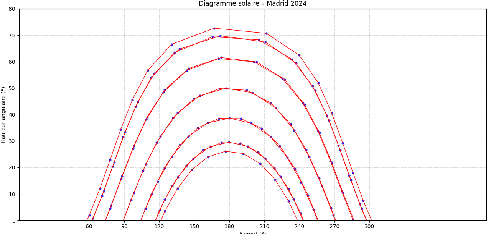

# ☀️ Diagramme Solaire en Python  

Un projet Python permettant de **visualiser la position du Soleil et ses trajectoires** en fonction de la **localisation géographique** et du **mois choisi**.  

## 📌 Fonctionnalités  
- Calcul de la trajectoire du Soleil sur une journée donnée  
- Prise en compte de la localisation (latitude / longitude)  
- Choix du mois pour visualiser les variations saisonnières  
- Génération d’un **diagramme solaire** clair et lisible avec `matplotlib`
  
## ▶️ Usage  

Pour lancer le programme et générer un diagramme solaire, ouvrez `main.py` dans votre éditeur Python et exécutez-le.  

### Paramètres (dans le script) :  
- **Latitude** : définie dans le code (ex: `latitude = 48.85` pour Paris)  
- **Longitude** : définie dans le code (ex: `longitude = 2.35` pour Paris)  

👉 Pour changer de lieu, modifiez directement ces variables dans `main.py`.  
### Exemple :  
Dans `main.py` :  
```python
latitude = 40.4167047     # Madrid
longitude = -3.7035825
```

